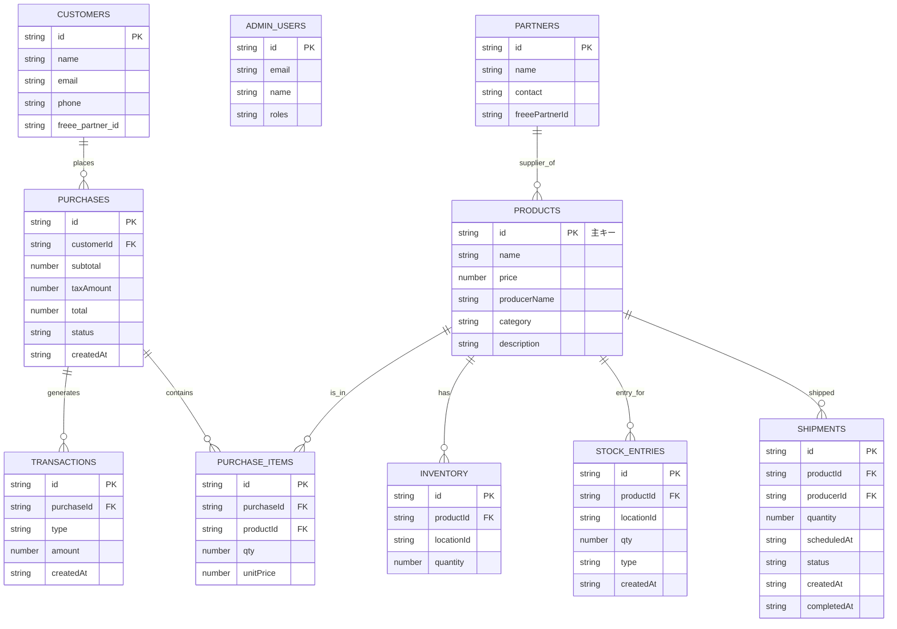

# ER 図（Mermaid）

以下は Firestore をベースにした主要コレクションの ER 図です（Mermaid 構文）。

```mermaid
erDiagram
    PRODUCTS {
      string id PK "主キー"
      string name
      number price
      string producerName
      string category
      string description
    }

    INVENTORY {
      string id PK
      string productId FK
      string locationId
      number quantity
    }

    CUSTOMERS {
      string id PK
      string name
      string email
      string phone
      string freee_partner_id
    }

    PURCHASES {
      string id PK
      string customerId FK
      number subtotal
      number taxAmount
      number total
      string status
      string createdAt
    }

    PURCHASE_ITEMS {
      string id PK
      string purchaseId FK
      string productId FK
      number qty
      number unitPrice
    }

    TRANSACTIONS {
      string id PK
      string purchaseId FK
      string type
      number amount
      string createdAt
    }

    ADMIN_USERS {
      string id PK
      string email
      string name
      string roles
    }

    PARTNERS {
      string id PK
      string name
      string contact
      string freeePartnerId
    }

    STOCK_ENTRIES {
      string id PK
      string productId FK
      string locationId
      number qty
      string type
      string createdAt
    }

    SHIPMENTS {
      string id PK
      string productId FK
      string producerId FK
      number quantity
      string scheduledAt
      string status
      string createdAt
      string completedAt
    }

    PRODUCTS ||--o{ INVENTORY : "has"
    PRODUCTS ||--o{ PURCHASE_ITEMS : "is_in"
    PURCHASES ||--o{ PURCHASE_ITEMS : "contains"
    CUSTOMERS ||--o{ PURCHASES : "places"
    PURCHASES ||--o{ TRANSACTIONS : "generates"
    PRODUCTS ||--o{ STOCK_ENTRIES : "entry_for"
    PRODUCTS ||--o{ SHIPMENTS : "shipped"
    PARTNERS ||--o{ PRODUCTS : "supplier_of"

```

注: Firestore はドキュメント指向データベースのため ER 図は概念図です。実装時はドキュメント設計（ネスト / サブコレクション）を検討してください。
