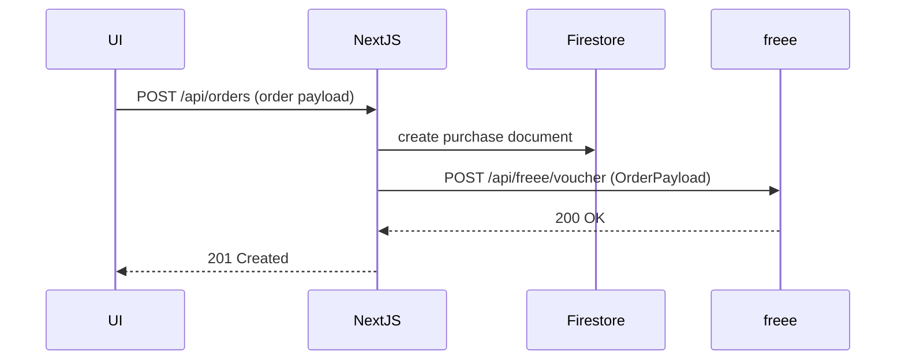
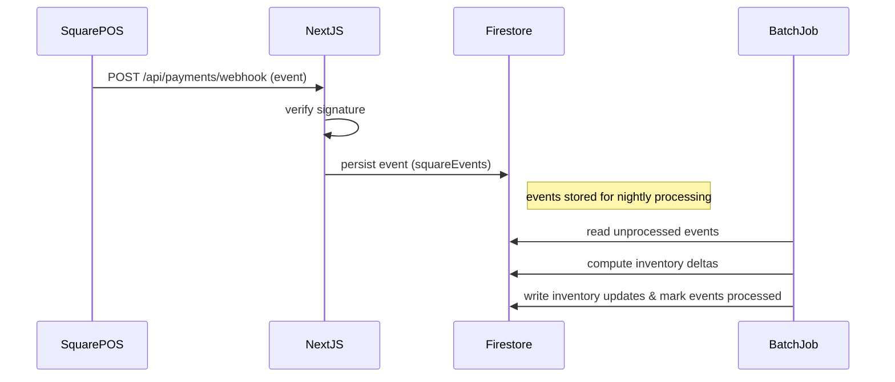
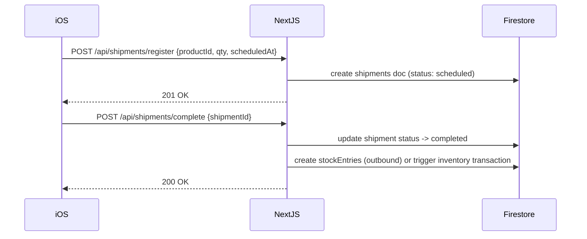

# シーケンス図（Mermaid）

以下は主要フローのシーケンス図（Mermaid）です。

## 1) 注文 → freee 仕訳送信フロー

```mermaid
sequenceDiagram
  participant UI
  participant NextJS
  participant Firestore
  participant freee

  UI->>NextJS: POST /api/orders (order payload)
  NextJS->>Firestore: create purchase document
  NextJS->>freee: POST /api/freee/voucher (OrderPayload)
  freee-->>NextJS: 200 OK
  NextJS-->>UI: 201 Created

```

## 2) POS (Square) → Webhook → 夜間在庫反映

```mermaid
sequenceDiagram
  participant SquarePOS
  participant NextJS
  participant Firestore
  participant BatchJob

  SquarePOS->>NextJS: POST /api/payments/webhook (event)
  NextJS->>NextJS: verify signature
  NextJS->>Firestore: persist event (squareEvents)
  Note right of Firestore: events stored for nightly processing

  BatchJob->>Firestore: read unprocessed events
  BatchJob->>Firestore: compute inventory deltas
  BatchJob->>Firestore: write inventory updates & mark events processed

```

## 3) 生産者出荷フロー (iOS)

```mermaid
sequenceDiagram
  participant iOS
  participant NextJS
  participant Firestore

  iOS->>NextJS: POST /api/shipments/register {productId, qty, scheduledAt}
  NextJS->>Firestore: create shipments doc (status: scheduled)
  NextJS-->>iOS: 201 OK

  iOS->>NextJS: POST /api/shipments/complete {shipmentId}
  NextJS->>Firestore: update shipment status -> completed
  NextJS->>Firestore: create stockEntries (outbound) or trigger inventory transaction
  NextJS-->>iOS: 200 OK

```
